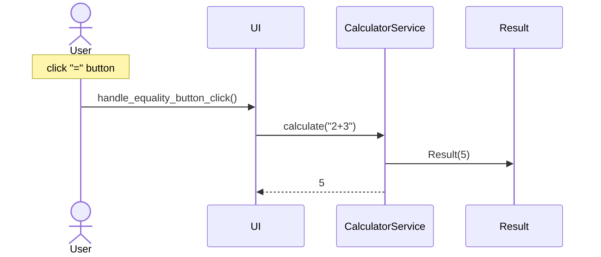

# Arkkitehtuurikuvaus

## Rakenne

### Pakkauskaavio

Pakkaus entities sisältää ohjelman käyttämistä tietoa kuvaavista ja säilyttävistä luokista koostuvan ohjelmakoodin. Pakkaus ui sisältää käyttöliittymästä, pakkaus services sovelluslogiikasta ja pakkaus repositories tiedosto-operaatioista vastaavan ohjelmakoodin. 

## Sovelluslogiikka

...

## Päätoiminnallisuudet

Tässä osiossa kuvataan sekvenssikaavioilla sovelluksen toimintalogiikkaa päätoiminnallisuuksien osalta.

### Lausekkeen laskeminen

Kun käyttäjä on klikkaillut tai kirjoittanut lausekkeen käyttöliittymän syötekenttään ja klikkaa näppäintä "=", etenee sovelluksen kontrolli seuraavasti:

Käyttöliittymästä vastaavan `UI`-luokan tapahtumankäsittelijä `handle_equality_button_click` kutsuu sovelluslogiikasta vastaavan `CalculatorService`-luokan metodia `calculate`, jolle annetaan parametrina käyttäjän syöttämä lauseke. Metodi `calculate` luo uuden `Result`-luokan olion vastaamaan laskettua tulosta, jotta se voidaan tarvittaessa tallettaa laskimen muistiin. Tämän jälkeen metodi `calculate` palauttaa lasketun tuloksen käyttöliittymälle, joka päivittää näkymänsä niin, että käyttäjä näkee tuloksen.
