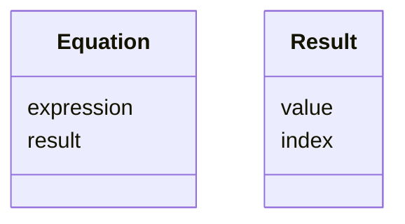
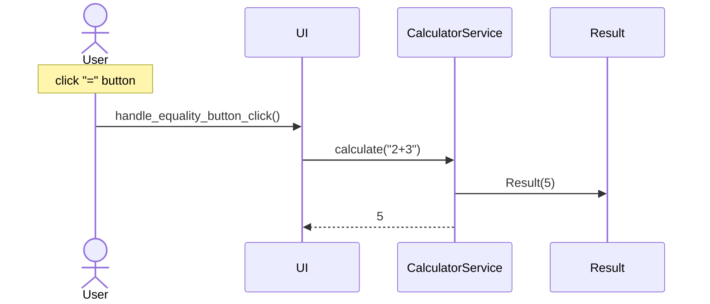

# Arkkitehtuurikuvaus

## Rakenne

### Pakkauskaavio

Pakkaus entities sisältää ohjelman käyttämistä tietoa kuvaavista ja säilyttävistä luokista koostuvan ohjelmakoodin. Pakkaus ui sisältää käyttöliittymästä, pakkaus services sovelluslogiikasta ja pakkaus repositories tiedosto-operaatioista vastaavan ohjelmakoodin. 

## Käyttöliittymä

Käyttöliittymä koostuu kolmesta erllisestä näkymästä

- Calculator-näkymä
- History-näkymä
- Stats-näkymä

Käyttäjälle näkyy kerrallaan aina yksi näistä näkymistä. Jokainen näkymä on toteutettu omana luokkanaan. UI-luokka vastaa näkymien näyttämisestä käyttäjälle ja niiden välillä siirtymisestä. Käyttöliittymän lähdekoodi on mahdollisimman paljon erillään sovelluslogiikan lähdekoodista. Käyttöliittymä kutsuu services-pakkauksen luokkien [CalculatorService](https://github.com/Deepthetics/ot-harjoitustyo/blob/master/src/services/calculator_service.py)- ja [StatsService](https://github.com/Deepthetics/ot-harjoitustyo/blob/master/src/services/stats_service.py)-luokkien metodeita.

## Sovelluslogiikka

Sovelluksen käsittelemää tietoa kuvaavat entities-pakkauksen luokat [Equation](https://github.com/Deepthetics/ot-harjoitustyo/blob/master/src/entities/equation.py) ja [Result](https://github.com/Deepthetics/ot-harjoitustyo/blob/master/src/entities/result.py):

Equation-luokan oliot kuvaavat yhtälöitä eli laskimella laskettuja lausekkeita, joita talletetaan laskimen laskuhistoriaan. Result-luokan oliot kuvaavat laskimella laskettuja tuloksia, joita voi tallettaa laskimen muistiin.

[CalculatorService](https://github.com/Deepthetics/ot-harjoitustyo/blob/master/src/services/calculator_service.py)-luokka vastaa käyttöliittymän luokkien [CalculatorView](https://github.com/Deepthetics/ot-harjoitustyo/blob/master/src/ui/calculator_view.py) ja [HistoryView](https://github.com/Deepthetics/ot-harjoitustyo/blob/master/src/ui/history_view.py) tarjoamista toiminnallisuuksista. [StatsService](https://github.com/Deepthetics/ot-harjoitustyo/blob/master/src/services/stats_service.py)-luokka vastaa käyttöliittymän luokan [StatsView](https://github.com/Deepthetics/ot-harjoitustyo/blob/master/src/ui/stats_view.py) tarjoamasta toiminnallisuudesta. [CalculatorService](https://github.com/Deepthetics/ot-harjoitustyo/blob/master/src/services/calculator_service.py)-luokka käsittelee sovelluksen tallettamia tietoja [EquationRepository](https://github.com/Deepthetics/ot-harjoitustyo/blob/master/src/repositories/equation_repository.py)- ja [ResultRepository](https://github.com/Deepthetics/ot-harjoitustyo/blob/master/src/repositories/result_repository.py)-luokkien tarjoaman toiminnallisuuksien kautta.

## Sovelluksen käyttämän tiedon pysyväistalletus

Tiedon pysyväistalletukseta vastaa repositories-pakkauksen luokat [EquationRepository](https://github.com/Deepthetics/ot-harjoitustyo/blob/master/src/repositories/equation_repository.py) ja [ResultRepository](https://github.com/Deepthetics/ot-harjoitustyo/blob/master/src/repositories/result_repository.py). Kumpikin luokka tallettaa tietoa csv-tiedostoon. Nämä luokat noudattavat Repository-suunnittelumallia, mikä mahdollistaa tiedon talletustavan vaivattomamman vaihtamisen tarvittaessa.

### Tiedostot

[EquationRepository](https://github.com/Deepthetics/ot-harjoitustyo/blob/master/src/repositories/equation_repository.py)- ja [ResultRepository](https://github.com/Deepthetics/ot-harjoitustyo/blob/master/src/repositories/result_repository.py)-luokat tallettavat erillisiin tiedostoihin. Sovelluksen juuressa olevassa .env-tiedostossa määritellään käytettävien tiedostojen nimet.

Laskuhistoria talletetaan tiedostoon riveinä:
"equation.expression;equation.result;"

Yhtälön lauseketta kuvaa "equation.expression" ja lausekkeen tulosta "equation.result". Nämä arvot erotellaan toisistaan ";"-merkillä.

Laskimen muistiin talletetut tulokset talletetaan tiedostoon riveinä:
"result.value"

Tulosta kuvaa "result.value".

## Päätoiminnallisuudet

Tässä osiossa kuvataan sekvenssikaavioilla sovelluksen toimintalogiikkaa päätoiminnallisuuksien osalta.

### Lausekkeen laskeminen

Kun käyttäjä on klikkaillut tai kirjoittanut lausekkeen käyttöliittymän syötekenttään ja klikkaa näppäintä "=", etenee sovelluksen kontrolli seuraavasti:

Käyttöliittymästä vastaavan `UI`-luokan tapahtumankäsittelijä `handle_equality_button_click` kutsuu sovelluslogiikasta vastaavan `CalculatorService`-luokan metodia `calculate`, jolle annetaan parametrina käyttäjän syöttämä lauseke. Metodi `calculate` luo uuden `Result`-luokan olion vastaamaan laskettua tulosta, jotta se voidaan tarvittaessa tallettaa laskimen muistiin. Tämän jälkeen metodi `calculate` palauttaa lasketun tuloksen käyttöliittymälle, joka päivittää näkymänsä niin, että käyttäjä näkee tuloksen.

## Tiedostetut heikkoudet sovelluksen rakenteessa

### Käyttöliittymä

Käyttöliittymän [CalculatorView](https://github.com/Deepthetics/ot-harjoitustyo/blob/master/src/ui/calculator_view.py)-luokan lähdekoodissa on paljon toisteisuutta tämän näkymän painikkeiden luomisen ja näkymään sijoittamisen yhteydessä. Koska tähän näkymään on vielä tarkoitus lisätä uusia painikkeita uusia toiminnallisuuksia varten, mahdollinen silmukkarakenne, joka kävisi läpi listaa kaikkien näkymään sijoitettavien painikkeiden symboleista ja niiden sijainneista, täytyisi joka kerta kirjoittaa uudelleen, kun lisätään uusi painike ja/tai muutetaan painikkeiden sijainteja näkymässä.

### Tietoa kuvaavat luokat
[Result](https://github.com/Deepthetics/ot-harjoitustyo/blob/master/src/entities/result.py)-luokka, joka kuvaa laskimella laskettua tulosta, joka voidaan tallettaa laskimen muistiin on toistaiseksi vielä hieman triviaali, koska sillä on vain yksi käytössä oleva attribuutti: "value". Tulokset voitaisiin pysyväistallettaa ilman, että ne muutetaan Result-luokan olioiksi. Laskimen muistitoiminnallisuuksia on tarkoitus vielä laajentaa ja ottaa käyttöön tämän luokan toinen attribuutti: "index". Tämän on tarkoitus mahdollistaa yksittäisiin ja tiettyihin tuloksiin viittaaminen.
