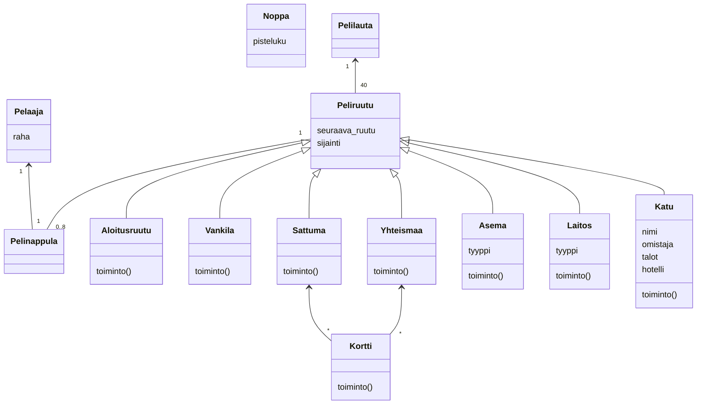

## Luokkakaavio Monopolista

```mermaid
classDiagram
  class Noppa{
    pisteluku
  }
  class Pelaaja{
    raha
  }
  class Peliruutu{
    seuraava_ruutu
    sijainti
  }
  class Katu{
    nimi
    omistaja
    talot
    hotelli
    toiminto()
  }
  class Kortti{
    toiminto()
  }
  class Aloitusruutu{
    toiminto()
  }
  class Vankila{
    toiminto()
  }
  class Sattuma{
    toiminto()
  }
  class Yhteismaa{
    toiminto()
  }
  class Asema{
    tyyppi
    toiminto()
  }
  class Laitos{
    tyyppi
    toiminto()
  }
  Pelaaja "1" <-- "1" Pelinappula
  Pelilauta "1" <-- "40" Peliruutu
  Peliruutu "1" -- "0..8" Pelinappula
  Peliruutu <|-- Aloitusruutu
  Peliruutu <|-- Vankila
  Peliruutu <|-- Sattuma
  Peliruutu <|-- Yhteismaa
  Peliruutu <|-- Asema
  Peliruutu <|-- Laitos
  Peliruutu <|-- Katu
  Sattuma <-- "*" Kortti
  Yhteismaa <-- "*" Kortti
```
