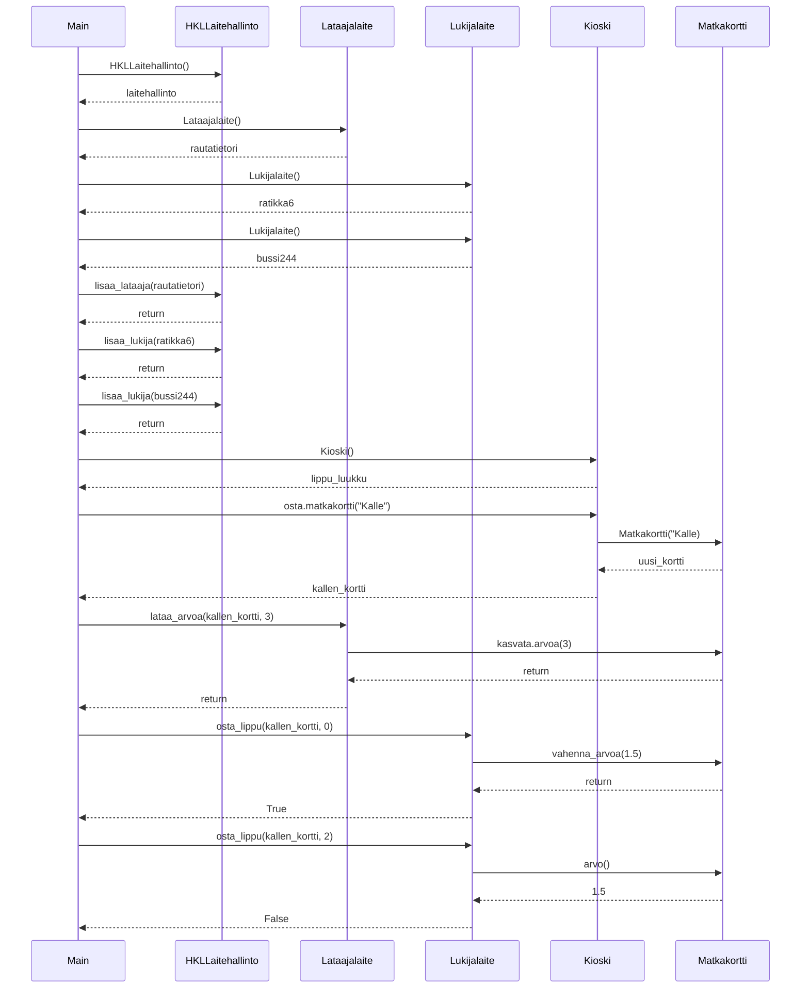

## Sekvenssikaavio Tehtävään 4

```mermaid
  sequenceDiagram
  participant Main
  participant HKLLaitehallinto
  participant Lataajalaite
  participant Lukijalaite
  participant Kioski
  participant Matkakortti
  Main->>HKLLaitehallinto: HKLLaitehallinto()
  HKLLaitehallinto-->>Main: laitehallinto
  Main->>Lataajalaite: Lataajalaite()
  Lataajalaite-->>Main: rautatietori
  Main->>Lukijalaite: Lukijalaite()
  Lukijalaite-->>Main: ratikka6
  Main->>Lukijalaite: Lukijalaite()
  Lukijalaite-->>Main: bussi244
  Main->>HKLLaitehallinto: lisaa_lataaja(rautatietori)
  HKLLaitehallinto-->>Main: return
  Main->>HKLLaitehallinto: lisaa_lukija(ratikka6)
  HKLLaitehallinto-->>Main: return
  Main->>HKLLaitehallinto: lisaa_lukija(bussi244)
  HKLLaitehallinto-->>Main: return
  Main->>Kioski: Kioski()
  Kioski-->>Main: lippu_luukku
  Main->>Kioski: osta.matkakortti("Kalle")
  Kioski->>Matkakortti: Matkakortti("Kalle)
  Matkakortti-->>Kioski: uusi_kortti
  Kioski-->>Main: kallen_kortti
  Main->>Lataajalaite: lataa_arvoa(kallen_kortti, 3)
  Lataajalaite->>Matkakortti: kasvata.arvoa(3)
  Matkakortti-->>Lataajalaite: return
  Lataajalaite-->>Main: return
  Main->>Lukijalaite: osta_lippu(kallen_kortti, 0)
  Lukijalaite->>Matkakortti: vahenna_arvoa(1.5)
  Matkakortti-->>Lukijalaite: return
  Lukijalaite-->>Main: True
  Main->>Lukijalaite: osta_lippu(kallen_kortti, 2)
  Lukijalaite->>Matkakortti: arvo()
  Matkakortti-->>Lukijalaite: 1.5
  Lukijalaite-->>Main: False
```
