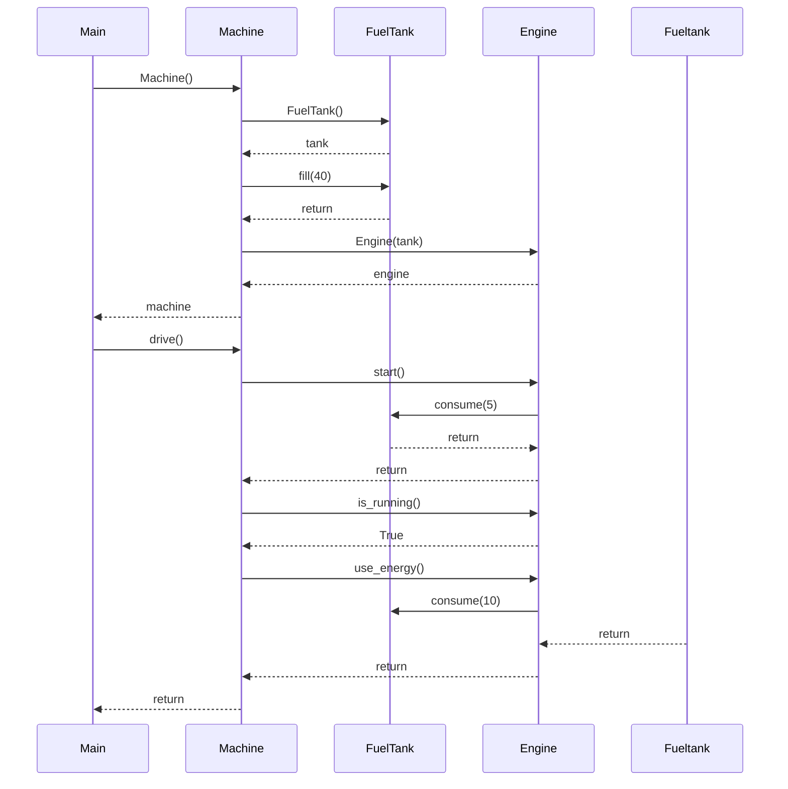

## Sekvenssikaavio Tehtävään 3

```mermaid
sequenceDiagram
  participant Main
  participant Machine
  participant FuelTank
  participant Engine
  Main->>Machine: Machine()
  Machine->>FuelTank: FuelTank()
  FuelTank-->>Machine: tank
  Machine->>FuelTank: fill(40)
  FuelTank-->>Machine: return
  Machine->>Engine: Engine(tank)
  Engine-->>Machine: engine
  Machine-->>Main: machine
  Main->>Machine: drive()
  Machine->>Engine: start()
  Engine->>FuelTank: consume(5)
  FuelTank-->>Engine: return
  Engine-->>Machine: return
  Machine->>Engine: is_running()
  Engine-->>Machine: True
  Machine->>Engine: use_energy()
  Engine->>FuelTank: consume(10)
  Fueltank-->>Engine: return
  Engine-->>Machine: return
  Machine-->>Main: return
```
